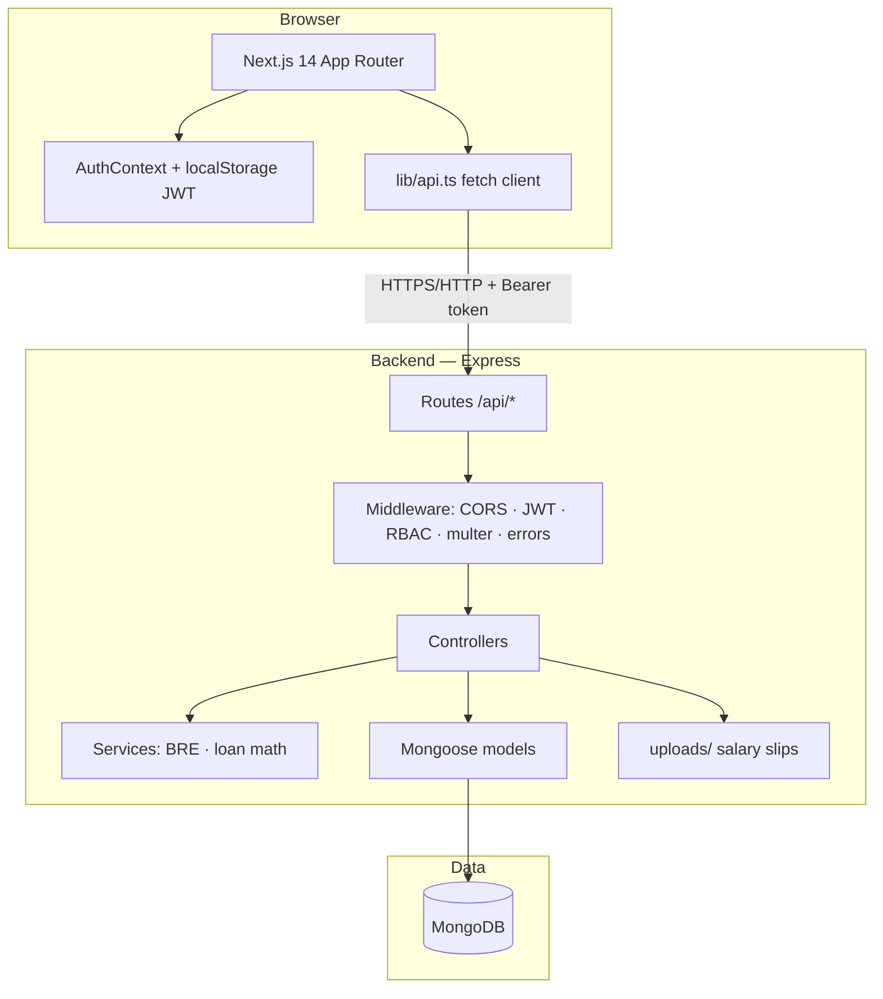
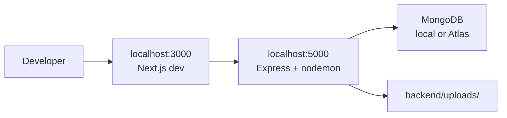
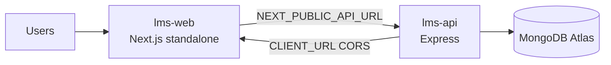
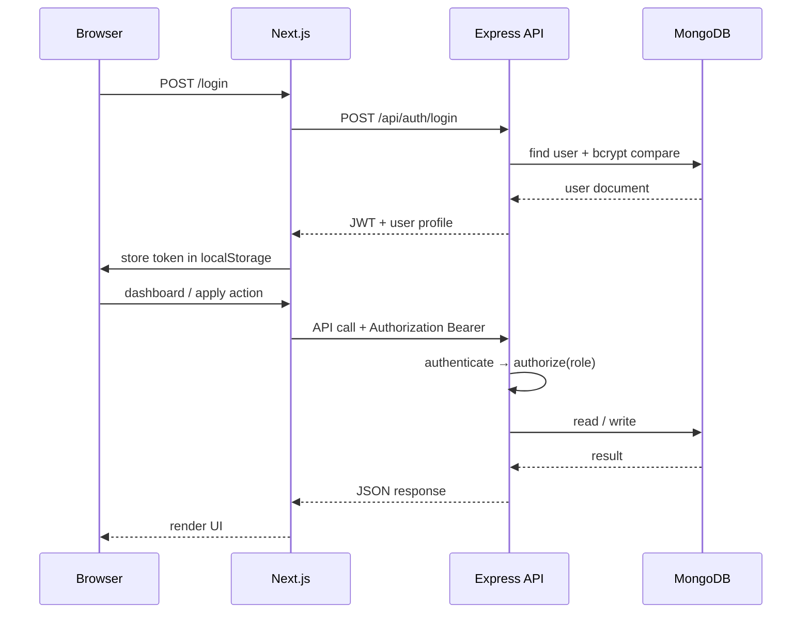

# Lendly — Loan Management System

A full-stack lending platform where **borrowers** apply for loans through a guided
multi-step flow, and **internal teams** move each loan through its lifecycle from a
role-guarded operations dashboard.

- **Frontend:** Next.js 14 (App Router) · TypeScript · Tailwind CSS
- **Backend:** Node.js · Express · TypeScript
- **Database:** MongoDB · Mongoose
- **Auth:** JWT · bcrypt

---

## Table of contents

1. [Architecture](#architecture)
2. [Project structure](#project-structure)
3. [Prerequisites](#prerequisites)
4. [Setup & running](#setup--running)
5. [Login credentials](#login-credentials)
6. [Data model](#data-model)
7. [Loan lifecycle](#loan-lifecycle)
8. [REST API](#rest-api)
9. [Role-based access control](#role-based-access-control)
10. [Design decisions](#design-decisions)
11. [Deploy on Render](#deploy-on-render)

---

## Architecture

Lendly is a **monorepo** with a browser client, a REST API, and MongoDB. The frontend
never talks to the database directly — all business rules and persistence go through the
API.

### System overview



| Layer | Technology | Responsibility |
| ----- | ---------- | -------------- |
| **UI** | Next.js, React, Tailwind | Pages, forms, role-guarded dashboard, multi-step apply flow |
| **API** | Express, TypeScript | Auth, RBAC, loan lifecycle, file upload/stream, validation |
| **Data** | MongoDB, Mongoose | `users`, `loans`, `payments` collections |
| **Auth** | JWT + bcrypt | Stateless sessions; password hashed on save |

### Local development



| Service | URL | Config |
| ------- | --- | ------ |
| Frontend | `http://localhost:3000` | `NEXT_PUBLIC_API_URL` → API |
| Backend | `http://localhost:5000` | `MONGODB_URI`, `JWT_SECRET`, `CLIENT_URL` → frontend (CORS) |

### Production (Render + Docker)

Deploy via the root [`render.yaml`](render.yaml) Blueprint — two Docker web services and
external MongoDB (e.g. Atlas). See [DEPLOY_RENDER.md](DEPLOY_RENDER.md) for steps.



| Render service | Image | Notes |
| -------------- | ----- | ----- |
| `lms-web` | `frontend/Dockerfile` | `output: 'standalone'`; API URL baked in at **build** time |
| `lms-api` | `backend/Dockerfile` | Listens on `0.0.0.0` + `PORT`; seed test users manually via Shell |

### Request & auth flow



1. **Login / signup** — API returns a JWT; the client stores it and sends
   `Authorization: Bearer <token>` on protected routes.
2. **Route guards** — `ProtectedRoute` and the sidebar limit what each role sees in the UI.
3. **Server enforcement** — every sensitive handler uses `authenticate` + `authorize(...)`;
   the UI alone cannot grant access.

### Backend layering

```
HTTP request
    → routes/*.ts          (path + method, mount prefixes)
    → middleware/          (auth, RBAC, multer, error wrapper)
    → controllers/*.ts     (parse input, call services/models, respond)
    → services/*.ts        (BRE, interest math — pure business logic)
    → models/*.ts          (Mongoose schemas, hooks, indexes)
    → MongoDB
```

### Role → module map

After login, users are routed by **role** (staff to dashboard modules, borrowers to
`/apply`):

| Role | Primary UI | API prefix |
| ---- | ---------- | ---------- |
| Borrower | `/apply`, loan status | `/api/loans` |
| Sales | `/dashboard/sales` | `/api/sales` |
| Sanction | `/dashboard/sanction` | `/api/sanction` |
| Disbursement | `/dashboard/disbursement` | `/api/disbursement` |
| Collection | `/dashboard/collection` | `/api/collection` |
| Admin | All dashboard modules | All of the above |

---

## Project structure

```
lms/
├── backend/
│   ├── src/
│   │   ├── config/         # env loading, Mongo connection
│   │   ├── models/         # User, Loan, Payment (Mongoose)
│   │   ├── middleware/     # auth (JWT), RBAC, upload (multer), error handler
│   │   ├── services/       # BRE (eligibility), loan math (simple interest)
│   │   ├── controllers/    # request handlers per concern
│   │   ├── routes/         # route definitions, mounted in app.ts
│   │   ├── utils/          # ApiError, asyncHandler, jwt helpers
│   │   ├── types/          # enums + business constants
│   │   ├── app.ts          # express app assembly
│   │   ├── server.ts       # entry point
│   │   └── seed.ts         # one account per role
│   ├── uploads/            # stored salary slips (gitignored)
│   └── .env.example
└── frontend/
    └── src/
        ├── app/            # App Router pages
        │   ├── login, signup
        │   ├── apply/      # multi-step borrower flow
        │   └── dashboard/  # overview + sales/sanction/disbursement/collection
        ├── components/     # UI primitives, header, route guard, trackers
        ├── context/        # AuthContext
        ├── lib/            # api client, formatting, loan math mirror
        └── types/
```

---

## Prerequisites

- **Node.js 18+**
- **MongoDB** running locally (`mongodb://127.0.0.1:27017`) or a MongoDB Atlas URI

---

## Setup & running

Open **two terminals** — one for the backend, one for the frontend.

### 1. Backend

```bash
cd backend
cp .env.example .env          # then edit values if needed
npm install
npm run seed                  # creates one account per role
npm run dev                   # starts API on http://localhost:5000
```

### 2. Frontend

```bash
cd frontend
cp .env.example .env.local    # NEXT_PUBLIC_API_URL=http://localhost:5000
npm install
npm run dev                   # starts app on http://localhost:3000
```

Open **http://localhost:3000**.

### Environment variables

**backend/.env**

| Variable          | Example                              | Purpose                       |
| ----------------- | ------------------------------------ | ----------------------------- |
| `PORT`            | `5000`                               | API port                      |
| `MONGODB_URI`     | `mongodb://127.0.0.1:27017/lms`      | Mongo connection string       |
| `JWT_SECRET`      | _(long random string)_               | Signs JWTs                    |
| `JWT_EXPIRES_IN`  | `7d`                                 | Token lifetime                |
| `CLIENT_URL`      | `http://localhost:3000`              | CORS allow-origin             |
| `MAX_FILE_SIZE_MB`| `5`                                  | Salary slip upload cap        |

**frontend/.env.local**

| Variable               | Example                  |
| ---------------------- | ------------------------ |
| `NEXT_PUBLIC_API_URL`  | `http://localhost:5000`  |

---

## Login credentials

The seed script (`npm run seed`) creates one account per role. **All share the same
password.**

| Role          | Email                    | Password      |
| ------------- | ------------------------ | ------------- |
| Admin         | `admin@lms.test`         | `Password123` |
| Sales         | `sales@lms.test`         | `Password123` |
| Sanction      | `sanction@lms.test`      | `Password123` |
| Disbursement  | `disbursement@lms.test`  | `Password123` |
| Collection    | `collection@lms.test`    | `Password123` |
| Borrower      | `borrower@lms.test`      | `Password123` |

> New borrowers can also self-register at `/signup`. Public signups always create a
> **Borrower** account — staff roles are provisioned only via the seed script.

The login screen has one-tap buttons that pre-fill each test account.

---

## Data model

Three collections.

### `users`

| Field      | Type     | Notes                                                  |
| ---------- | -------- | ------------------------------------------------------ |
| `name`     | string   |                                                        |
| `email`    | string   | unique, lowercased, indexed                            |
| `password` | string   | bcrypt hash, `select: false`                           |
| `role`     | enum     | Admin / Sales / Sanction / Disbursement / Collection / Borrower |

### `loans`

One document represents a borrower's application **and** the loan it becomes. Personal
details and the salary slip are captured during the draft stage; loan figures are set on
apply.

| Field                    | Type        | Notes                                          |
| ------------------------ | ----------- | ---------------------------------------------- |
| `borrower`               | ref `User`  | indexed                                        |
| `personalDetails`        | subdoc      | fullName, pan, dateOfBirth, monthlySalary, employmentMode |
| `salarySlip`             | subdoc      | fileName, originalName, mimeType, size         |
| `amount`                 | number      | ₹50,000 – ₹5,00,000                            |
| `tenureDays`             | number      | 30 – 365                                       |
| `interestRate`           | number      | fixed 12                                       |
| `simpleInterest`         | number      | computed server-side                           |
| `totalRepayment`         | number      | `amount + simpleInterest`                      |
| `status`                 | enum        | DRAFT / APPLIED / SANCTIONED / REJECTED / DISBURSED / CLOSED |
| `rejectionReason`        | string      | set when rejected                              |
| `amountPaid`             | number      | running total of payments                      |
| `outstanding`            | virtual     | `totalRepayment − amountPaid`                  |
| audit fields             | dates/refs  | appliedAt, sanctionedBy/At, disbursedBy/At, closedAt |

### `payments`

| Field        | Type        | Notes                                  |
| ------------ | ----------- | -------------------------------------- |
| `loan`       | ref `Loan`  | indexed                                |
| `utr`        | string      | **unique across all payments**         |
| `amount`     | number      | > 0, cannot exceed outstanding         |
| `date`       | date        |                                        |
| `recordedBy` | ref `User`  | the collection executive              |

**Relationships:** a `User` (borrower) has many `Loan`s (one active at a time in this
flow); a `Loan` has many `Payment`s.

---

## Loan lifecycle

```
                 BRE fail ──► blocked (no loan created)
                    ▲
 sign up ──► DRAFT ─┴─► APPLIED ──► SANCTIONED ──► DISBURSED ──► CLOSED
 (borrower)  (borrower)  (borrower)   │              (disburse)   (auto: paid
                                      └─► REJECTED                 in full)
                                          (sanction, w/ reason)
```

| Transition                | Trigger              | Allowed roles            |
| ------------------------- | -------------------- | ------------------------ |
| → DRAFT                   | personal details pass BRE | Borrower            |
| DRAFT → APPLIED           | apply (config + slip)| Borrower                 |
| APPLIED → SANCTIONED      | approve              | Sanction (+ Admin)       |
| APPLIED → REJECTED        | reject (reason req.) | Sanction (+ Admin)       |
| SANCTIONED → DISBURSED    | disburse             | Disbursement (+ Admin)   |
| DISBURSED → CLOSED        | **automatic** when `amountPaid ≥ totalRepayment` | Collection records the final payment (+ Admin) |

Every transition is re-validated on the server — e.g. you cannot disburse a loan that
is not `SANCTIONED`, and payments are rejected unless the loan is `DISBURSED`.

---

## REST API

Base URL: `http://localhost:5000`. All protected routes expect
`Authorization: Bearer <token>`.

### Auth — `/api/auth`

| Method | Path        | Body                        | Notes                       |
| ------ | ----------- | --------------------------- | --------------------------- |
| POST   | `/signup`   | `{ name, email, password }` | Creates a Borrower → token  |
| POST   | `/login`    | `{ email, password }`       | → token + user              |
| GET    | `/me`       | —                           | Current user (auth)         |

### Borrower loan flow — `/api/loans` _(Borrower)_

| Method | Path                | Body / Query                              | Notes                                  |
| ------ | ------------------- | ----------------------------------------- | -------------------------------------- |
| GET    | `/me`               | —                                         | Borrower's loan + payments             |
| GET    | `/quote`            | `?amount=&tenureDays=`                    | Live repayment calculation             |
| POST   | `/personal-details` | `{ fullName, pan, dateOfBirth, monthlySalary, employmentMode }` | Runs BRE; 422 with reasons on fail |
| POST   | `/salary-slip`      | multipart, field `salarySlip`             | PDF/JPG/PNG, ≤ 5 MB                     |
| POST   | `/apply`            | `{ amount, tenureDays }`                  | Recomputes interest, sets APPLIED      |

### Sales — `/api/sales` _(Sales / Admin)_

| Method | Path      | Notes                                          |
| ------ | --------- | ---------------------------------------------- |
| GET    | `/leads`  | Borrowers + funnel stage (REGISTERED / IN_PROGRESS / APPLIED) |

### Sanction — `/api/sanction` _(Sanction / Admin)_

| Method | Path                  | Body         | Notes                |
| ------ | --------------------- | ------------ | -------------------- |
| GET    | `/loans`              | —            | Loans in APPLIED     |
| POST   | `/loans/:id/approve`  | —            | → SANCTIONED         |
| POST   | `/loans/:id/reject`   | `{ reason }` | → REJECTED           |

### Disbursement — `/api/disbursement` _(Disbursement / Admin)_

| Method | Path                   | Notes                  |
| ------ | ---------------------- | ---------------------- |
| GET    | `/loans`               | Loans in SANCTIONED    |
| POST   | `/loans/:id/disburse`  | → DISBURSED            |

### Collection — `/api/collection` _(Collection / Admin)_

| Method | Path                   | Body                    | Notes                                   |
| ------ | ---------------------- | ----------------------- | --------------------------------------- |
| GET    | `/loans`               | —                       | DISBURSED + CLOSED loans                |
| GET    | `/loans/:id`           | —                       | Loan detail + payment history           |
| POST   | `/loans/:id/payments`  | `{ utr, amount, date }` | Validates UTR uniqueness & amount; auto-closes when fully repaid |

### Files — `/api/files`

| Method | Path                      | Notes                                                |
| ------ | ------------------------- | ---------------------------------------------------- |
| GET    | `/salary-slip/:loanId`    | Streams the slip; owner or any staff role; `?token=` accepted for link opens |

---

## Role-based access control

Roles: **Admin, Sales, Sanction, Disbursement, Collection, Borrower**.

- **Two layers, both enforced.** The frontend hides modules a role can't use and
  redirects on bad navigation (`ProtectedRoute`, role-aware sidebar). The backend
  independently guards **every** route with `authenticate` + `authorize(...roles)`, so a
  direct API call with the wrong role is rejected regardless of the UI.
- **Admin** passes every `authorize` check (sees all four modules).
- Each **executive** role can reach only its own module.
- **Borrowers** can use the application portal but not the dashboard.
- **Status codes:** `401` when no/invalid token; `403` when authenticated but the role
  isn't permitted.

---

## Design decisions

**What's the correct PAN regex?**
`^[A-Z]{5}[0-9]{4}[A-Z]$` — five letters, four digits, a trailing letter (e.g.
`ABCDE1234F`). Input is upper-cased before matching.

**Should the BRE live on the client, server, or both?**
The decision is enforced on the **server** (`services/bre.ts`) — it's the only place
that can't be bypassed, since anyone can call the API directly and skip the UI. The
client mirrors the same rules (`lib/loan.ts`) purely for instant feedback, but the
server result is authoritative and is the only thing that creates the application.

**Why recompute loan interest on the server?**
The slider panel computes simple interest live for UX, but `/apply` recomputes it from
the submitted `amount`/`tenureDays` so the stored figures can't be tampered with from
the client.

**How are payments kept consistent?**
UTR uniqueness is enforced both by an explicit check (for a friendly message) and a
unique DB index (the real guard against races). Payment amount must be `> 0` and may not
exceed the current outstanding balance. When `amountPaid` reaches `totalRepayment`, the
loan auto-closes in the same request.

**Folder structure** follows a conventional layered backend (routes → controllers →
services/models) and the Next.js App Router convention on the frontend, with shared UI
primitives and a thin typed API client.

---

## Deploy on Render

Dockerfiles live in `backend/` and `frontend/`; orchestration is in [`render.yaml`](render.yaml).

```bash
# Quick reference — full guide in DEPLOY_RENDER.md
# 1. Push repo to GitHub
# 2. Render → New → Blueprint → set MONGODB_URI when prompted
# 3. Open lms-web URL; sign in with seeded test accounts
```

See **[DEPLOY_RENDER.md](DEPLOY_RENDER.md)** for Atlas networking, env vars, seeding, and
upload storage notes.

---